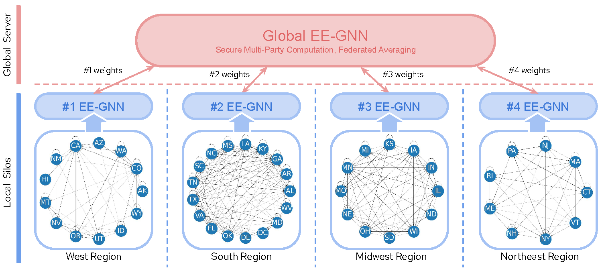

# FLEE-GNN
## FLEE-GNN: A Federated Learning System for Edge-Enhanced Graph Neural Network in Analyzing Geospatial Resilience of Multicommodity Food Flows

## Abstract
Understanding and measuring the resilience of food supply networks is a global imperative to tackle increasing food insecurity. However, the complexity of these networks, with their multidimensional interactions and decisions, presents significant challenges. This paper proposes FLEE-GNN, a novel Federated Learning System for Edge-Enhanced Graph Neural Network, designed to overcome these challenges and enhance the analysis of geospatial resilience of multicommodity food flow network, which is one type of spatial networks. FLEE-GNN addresses the limitations of current methodologies, such as entropy-based methods, in terms of generalizability, scalability, and data privacy. It combines the robustness and adaptability of graph neural networks with the privacy-conscious and decentralized aspects of federated learning on food supply network resilience analysis across geographical regions. This paper also discusses FLEE-GNN's innovative data generation techniques, experimental designs, and future directions for improvement. The results show the advancements of this approach to quantifying the resilience of multicommodity food flow networks, contributing to efforts towards ensuring global food security using AI methods. The developed FLEE-GNN has the potential to be applied in other spatial networks with spatially heterogeneous sub-network distributions.

<p align="center">
    
</p>

## Acknowledgement
We acknowledge the funding support from the National Science Foundation funded AI institute [Grant No. 2112606] for Intelligent Cyberinfrastructure with Computational Learning in the Environment (ICICLE). Any opinions, findings, and conclusions or recommendations expressed in this material are those of the author(s) and do not necessarily reflect the views of the funder(s). 

## Reference
If you find our code or ideas useful for your research, please cite our paper:

Yuxiao Qu, Jinmeng Rao, Song Gao, Qianheng Zhang, Wei-Lun Chao, Yu Su, Michelle Miller, Alfonso Morales, Patrick Huber. (2023). [FLEE-GNN: A Federated Learning System for Edge-Enhanced Graph Neural Network in Analyzing Geospatial Resilience of Multicommodity Food Flows](https://doi.org/10.1145/3615886.3627742). In the Proceedings of 6th ACM SIGSPATIAL International Workshop on AI for Geographic Knowledge Discovery (GeoAI ’23), November 13, 2023, Hamburg, Germany. DOI: 10.1145/3615886.3627742


```
@inproceedings{qu2023flee-gnn,
  title={FLEE-GNN: A Federated Learning System for Edge-Enhanced Graph Neural Network in Analyzing Geospatial Resilience of Multicommodity Food Flows},
  author={Yuxiao Qu and Jinmeng Rao and Song Gao and Qianheng Zhang and Wei-Lun Chao and Yu Su and Michelle Miller and Alfonso Morales and Patrick Huber},
  booktitle={The 6th ACM SIGSPATIAL International Workshop on AI for Geographic Knowledge Discovery (GeoAI ’23)},
  year={2023},
  pages={1-10},
  organization={ACM}
}
```

## Environment Configuration

### Requirements

```
conda create -n resilience python=3.9

python -m pip install pandas numpy tqdm networkx matplotlib

```

### Plot (require geopandas support)

- Check `gdal-config`

```
brew install gdal
gdal-config --version
```

- Install python packages

```
python -m pip install gdal fiona pysal geopandas
```

## Scripts

### Generate Data

Generate `size` graphs with 1000-2000 edges.

- Random Generator

```
python ./scripts/generate_data_random.py --save-dir ./training/random_data/ --size 100
```

- Noise Generator

```
python ./scripts/generate_data_from_real_data.py --data-path ./data/2012_data.csv --save-dir ./training/noise_data_0.2/ --size 100 --noise-rate 0.2
```

### Generate Labels

Generate entropy-based resilience for all th data saved in `data-dir`. Some graphs is poor constructed, therefore, the computation will fail, but the error will be well-handled.

```
python ./scripts/generate_label.py --info-dir ./data/info --data-dir ./training/noise_data_0.2/ --label-dir ./training/noise_label_0.2/ --size 100
```

### Train Model

Save the best model and running loss to the `output-dir`.

```
python ./scripts/train.py --info-dir ./data/info/ --data-dir ./training/noise_data_0.2/ --label-dir ./training/noise_label_0.2/ --output-dir ./training/noise_output_0.2/ --size 100 --epochs 100
```

### Evaluate Model

Use the pre-trained model predict the resilience of a given graph, the predication value will be saved in `output-dir/predict.csv`.

```
python ./scripts/evaluation.py --info-dir ./data/info/ --data-path ./data/2012_data.csv --label-path ./data/2012_label.csv --model-path ./training/random_output/best_model.pth --output-dir ./training/random_output/
```

### Plot Resilience Map

Plot the resilience heatmap for ground true label saved in `true-label-path`, predict value saved in `predict-label-path`, and the difference between these two.

```
python ./scripts/plot_resilience.py --true-label-path ./data/2012_label.csv --predict-label-path ./training/random_output/predict.csv --info-dir ./data/info/ --output-dir ./training/random_output/
```
